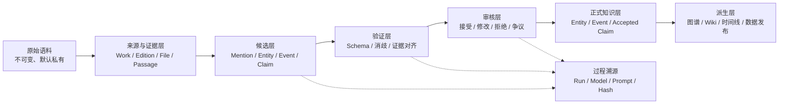

# 交通工程学科知识图谱项目规范

> 英文名称：Traffic Engineering Knowledge Graph（TEKG）  
> 规范编号：TEKG-SPEC  
> 规范版本：0.1.0  
> 状态：Draft Baseline  
> 最后更新：2026-07-15

## 1. 文档目的

本文档定义交通工程学科知识图谱项目的产品边界、核心概念、数据模型、证据与引用规则、知识提取流程、存储架构、人工审核机制、质量标准和分阶段实施路径。

本文档是项目的最高级技术与数据规范。实现、数据迁移、Prompt、审核工具和派生页面均不得与本文档冲突。需要改变已锁定架构决策时，必须先提交架构决策记录（ADR），再修改本文档和相应版本号。

本文档使用以下规范性词语：

- **必须（MUST）**：不可违反的要求。
- **不得（MUST NOT）**：明确禁止的做法。
- **应该（SHOULD）**：默认必须遵循；偏离时必须记录理由。
- **可以（MAY）**：可选实现，不影响规范符合性。

## 2. 项目定义

TEKG 是一套面向交通工程学科史的、证据优先、陈述中心、事件感知的知识基础设施。

项目的首要产物不是历史叙事或百科页面，而是：

1. 可识别、可约束的领域实体；
2. 可定位到具体资料片段的原子知识陈述；
3. 可表达人物、事件、方法、工具、机构和理念演化的关系；
4. 可记录冲突、观点归属、历史评价和不确定性的审核体系；
5. 可复现的 Agent/LLM 知识提取流水线；
6. 可由正式数据生成的图谱、时间线、人物页、方法谱系和专题材料。

正式定位：

> 一个以交通工程和城市交通为核心，以道路交通为主要历史现场，以公共交通和城市轨道为必要组成，以铁路、水运、航空相关方法和综合运输接口为外围的可审计学科知识图谱。

## 3. 基本假设

本规范基于以下假设：

1. v0.1 是本地优先、单用户维护的研究项目。
2. 资料以书籍、论文、报告、标准、法规、机构史和档案为主，可能包含受版权保护内容。
3. 原始资料和完整解析文本主要保存在本地私有空间，不默认公开。
4. 第一阶段重点是事实底座和知识提取流程，不是完整交通工程史叙事。
5. Python 实现必须使用：
   `/Users/ran/WorkSpace/SoftWare/miniconda3/envs/research/bin/python3.10`
6. 人工审核者是正式知识的最终接受者；LLM 不是事实权威。
7. 项目规模稳定增长后，才评估多人协作、图数据库和公开服务。

若上述假设发生实质变化，必须重新评估存储、权限和审核架构。

### 3.1 当前实施里程碑：v0.0 Extraction Wiki

项目首先实现一个轻量、英文优先、仅负责知识提取的 Traffic Wiki：

- 用户向 Agent 提供文本、章节、论文或报告；
- Agent 提取来源、候选实体和带证据的原子 Claim；
- 英文作为实体规范名称，多语言译名、别名、缩写、旧称和转写保存在结构化 `names[]` 中；
- 结果写入 `traffic-wiki/data/` 下的 `sources.jsonl`、`entities.jsonl`、`claims.jsonl` 和 `runs.jsonl`；
- 所有 Agent/LLM 提取结果固定为 `proposed`；
- Markdown 实体页、索引和 `graph.json` 由 JSONL 确定性生成；
- 项目内 `.agents/skills/build-traffic-wiki/` 负责抽取、合并、校验和派生视图构建。

该里程碑只实现候选知识提取层。JSONL 在此阶段是可维护的抽取数据集和未来正式库的导入来源，不取代第 16 节规定的正式 SQLite 权威层。v0.0 不建设审核界面、历史叙事、Neo4j、向量检索或多 Agent 系统。

## 4. 项目范围

### 4.1 核心范围

以下主题属于核心范围：

- 道路、街道与交叉口；
- 交通调查、数据采集与统计；
- 交通流理论；
- 通行能力与服务水平；
- 交通控制、信号与交通组织；
- 交通规划与需求预测；
- 网络分析与交通分配；
- 出行行为与离散选择；
- 道路安全与人因；
- 停车与交通需求管理；
- 公共交通优先；
- 步行、自行车与完整街道；
- 交通与土地利用；
- 可达性、机动性和交通公平；
- 智能交通、交通仿真和计算交通；
- 交通工程职业、教育、机构与规范体系。

### 4.2 接口范围

以下主题仅在与交通工程主线存在明确连接时纳入：

- 城市轨道交通与换乘；
- 综合交通枢纽；
- 铁路客流、网络与调度方法；
- 港口集疏运与多式联运；
- 机场陆侧交通和机场可达性；
- 城市物流和货运网络；
- 交通运输经济、能源和环境；
- 区域综合交通规划。

### 4.3 背景范围

以下内容只作为方法来源或时代背景：

- 铁路工业化；
- 蒸汽运输；
- 海运贸易体系；
- 航空时代；
- 军事运输与运筹学；
- 国家交通行政体系；
- 汽车工业、能源体系和全球供应链。

### 4.4 排除范围

以下内容不作为独立知识体系完整展开：

- 飞行器、船舶和车辆的详细机械设计；
- 空气动力学、水动力学和轮机工程；
- 铁路轨道材料、牵引和桥隧施工细节；
- 与交通工程知识形成无直接关系的运输企业通史；
- 没有可靠来源支持的名人轶事和流行说法。

每个实体或主题可以带有 `scope_position`：

- `core`
- `interface`
- `background`
- `excluded`

该字段必须附带受控理由，不得仅凭运输方式自动确定。

## 5. 非目标

v0.1 明确不追求：

1. 编写完整的交通工程学科史正文；
2. 自动生成并直接发布历史结论；
3. 建设覆盖全部交通运输方式的综合百科；
4. 建立完整的 CIDOC CRM、Wikidata 或通用上层本体实现；
5. 把 Markdown 页面或 Obsidian 双链作为正式知识图谱；
6. 让 Agent 或 LLM 直接修改已接受知识；
7. 以向量相似度、模型置信度或图算法结果判断事实真伪；
8. 在本体和数据稳定前建设复杂前端；
9. 在查询需求尚未证明前部署 Neo4j、RDF 三元组库或搜索集群；
10. 将受版权保护的完整书籍文本提交到公共仓库。

## 6. 核心设计原则

### 6.1 证据优先

每条正式 Claim 必须能定位到具体版本中的具体资料片段。没有证据定位的内容只能作为待研究线索，不能作为正式知识。

### 6.2 陈述中心

知识单元是 Claim，不是实体页面，也不是裸的图关系。实体、图边、时间线和页面均由 Claim 派生。

### 6.3 事件感知

历史过程通过 Event、参与者角色、时间、地点、产出和背景关系表达。系统不得用单一“出生年份”替代概念、方法或技术的形成过程。

### 6.4 来源观点与项目判断分离

原作者观点、后世历史解释和项目编辑判断必须使用不同的 `claim_kind`，并保留归属主体。

### 6.5 候选数据与正式数据隔离

LLM 只能生成候选实体、候选 Claim、候选合并和候选修正。只有确定性导入流程依据人工审核决定，才能改变正式数据。

### 6.6 原始记录不可覆盖

提取结果、审核决定、实体合并和废弃操作必须追加记录。修订不得抹除原始模型输出和历史决策。

### 6.7 单一逻辑权威

SQLite 正式数据库是 v0.1 的运行时权威数据源。JSONL、JSON-LD、Neo4j、RDF、Markdown 和可视化均为派生表示，不得独立编辑后回写。

### 6.8 最小本体

只有在真实语料无法表达、查询问题无法回答或约束无法实施时，才新增实体类型、事件类型或谓词。

## 7. 能力问题

本体和数据模型至少必须能够回答以下问题：

1. 某个概念、方法或模型由谁在何时、哪部作品中提出、定义或形式化？
2. “首次提出”“奠基性工作”等判断由哪个来源作出，是否存在不同解释？
3. 某个方法经历了哪些扩展、批评、采用、实施和标准化过程？
4. 某项交通知识形成时，有哪些技术、制度、产业和社会背景？是谁建立了这些联系？
5. 某个人在机构、作品、事件和项目中分别承担了什么角色？
6. 某机构如何参与知识生产、职业化、教育、标准制定和工程实践？
7. 不同来源对同一事件、人物贡献或因果关系是否存在冲突？
8. 某一时间段内出现了哪些概念、方法、工具、政策和机构变化？
9. 某条知识来自哪一版本、哪一页和哪一段？经过了哪次提取和审核？
10. 能否从同一正式数据生成时间线、人物页、方法谱系和争议列表？

无法帮助回答以上问题的字段和抽象，默认不进入 v0.1。

## 8. 系统架构



系统分为五个逻辑区：

1. **Corpus**：原始资料和解析产物；
2. **Staging**：模型生成的候选数据；
3. **Canonical**：通过约束和审核的正式数据；
4. **Provenance**：提取、验证、审核和版本记录；
5. **Generated**：图、页面、时间线、检索索引和发布包。

任何跨区写入必须通过明确的导入或发布命令完成。

## 9. 概念模型

### 9.1 核心术语

| 术语 | 定义 |
|---|---|
| Entity | 可被稳定识别和引用的对象 |
| Mention | 某资料片段中出现的实体表述 |
| Event | 发生于时间中的活动、变化或过程 |
| Work | 抽象作品，如论文、书籍、报告、标准 |
| Edition | Work 的具体版本、译本或发行形态 |
| SourceFile | 某 Edition 的具体数字文件 |
| Passage | 可精确定位的证据片段 |
| Claim | 主体—谓词—客体构成的原子陈述 |
| Qualifier | 对 Claim 的时间、地点、角色、范围等限定 |
| EvidenceLink | Passage 对 Claim 的支持、反驳、提及或评价关系 |
| ReviewDecision | 人工对候选数据作出的追加式决定 |
| Projection | 从正式数据生成的图、页面或发布格式 |

### 9.2 上层类型

v0.1 使用以下轻量上层类型：

- `Agent`
- `PersistentEntity`
- `Event`
- `InformationObject`
- `ConceptualObject`
- `Place`
- `TimeSpan`
- `Claim`
- `Evidence`

上层类型主要用于一致性和外部映射，不直接替代交通领域类型。

### 9.3 领域实体类型

v0.1 允许的主要实体类型如下：

| 类型 | 含义 | 示例 |
|---|---|---|
| Person | 研究者、工程师、规划师、官员 | John G. Wardrop |
| Organization | 大学、协会、政府部门、企业 | ITE、TRB |
| Work | 论文、书籍、报告、法规、标准 | 某篇论文 |
| Edition | 原版、修订版、译本 | 第二版、中文版 |
| Event | 发表、采用、实施、成立、争论 | 标准颁布 |
| Concept | 思想或分析范畴 | 可达性 |
| Theory | 解释性理论体系 | 随机效用理论 |
| Method | 可重复执行的方法 | 四阶段法 |
| Model | 对系统的形式化表达 | LWR 模型 |
| Algorithm | 可执行计算步骤 | 最短路径算法 |
| Metric | 指标及其定义 | 服务水平 |
| Tool | 软件、仪器、调查工具 | 交通检测器 |
| Technology | 工程化或部署的技术系统 | 自适应信号控制 |
| Policy | 政策性信息对象 | 停车政策 |
| Standard | 标准、规范、手册 | 容量手册 |
| Project | 工程、规划或试点项目 | 城市交通规划项目 |
| InfrastructureSystem | 道路、网络、枢纽等系统 | 城市快速路系统 |
| Place | 国家、城市、区域、具体地点 | 伦敦 |
| NamedPeriod | 有学术意义的命名时期 | 战后汽车化时期 |

`Dataset` 可以在真实资料出现明确需求时加入；v0.1 不因技术偏好预先增加。

### 9.4 概念、方法、模型、算法和工具的边界

- `Concept` 表示思想或分析范畴。
- `Theory` 表示具有解释目标的理论体系。
- `Method` 表示可重复执行的分析或实践程序。
- `Model` 表示对现实系统的结构化或形式化表示。
- `Algorithm` 表示可执行的计算步骤。
- `Tool` 表示承载或辅助方法的软件、硬件、仪器或调查工具。
- `Technology` 表示被部署、制度化或工程化的技术系统。

同一名称可能在不同来源中指向不同层级。系统不得仅凭名称自动合并。

### 9.5 受控分类维度

以下内容使用受控词表，不建立大量子类：

- `topic`
- `transport_mode`
- `spatial_context`
- `geography`
- `discipline_scope`
- `scope_position`
- `source_level`
- `historical_perspective`

例如“城市交通流模型”应表示为 `Model`，并附加 `topic=traffic-flow`、`spatial_context=urban`，而不是创建 `UrbanTrafficFlowModel` 实体类型。

## 10. 事件模型

### 10.1 事件类型

v0.1 初始事件类型包括：

- `PublicationEvent`
- `ConceptIntroductionEvent`
- `FormalizationEvent`
- `AdoptionEvent`
- `ImplementationEvent`
- `StandardizationEvent`
- `InstitutionFormationEvent`
- `InstitutionChangeEvent`
- `PolicyEvent`
- `ProjectEvent`
- `DebateEvent`

新增事件类型必须附带：定义、使用案例、与现有类型的区别和查询需求。

### 10.2 何时创建 Event

满足下列任一条件时，应该创建 Event：

1. 需要表达多个参与者及不同角色；
2. 需要同时表达时间、地点、产出和对象；
3. 该事件需要作为时间线节点；
4. 多个来源对事件过程存在不同描述；
5. 事件本身具有持续时间或阶段。

简单作者关系、别名关系和单一分类不得强制包装成 Event。

### 10.3 “诞生”分解规则

系统不得把一个概念、方法或技术的历史压缩为无来源的 `born_in` 关系。应该区分：

- 前驱思想；
- 术语使用；
- 定义；
- 形式化；
- 发表；
- 扩展；
- 工程应用；
- 机构采用；
- 标准化；
- 教材化；
- 普及；
- 后世历史评价。

只有来源明确使用“首次”并经过高风险审核后，才能形成 `first_proposed` 类 Claim。

## 11. Claim 模型

### 11.1 基本结构

每条 Claim 必须包含：

- `claim_id`
- `subject_id`
- `predicate_id`
- `object_entity_id` 或类型化字面量
- `claim_kind`
- `assertion_mode`
- `polarity`
- `review_status`
- 至少一个 `EvidenceLink`
- `created_run_id` 或人工创建记录
- `ontology_version`
- 创建时间

### 11.2 Claim 类型

`claim_kind` 允许：

- `factual`
- `attributed_view`
- `historiographical_interpretation`
- `editorial_synthesis`

规则：

- `attributed_view` 必须具有 `attributed_to`。
- `historiographical_interpretation` 必须指向作出解释的 Work、Person 或 Organization。
- `editorial_synthesis` 必须由人工创建或明确批准，且引用其综合依据。
- 来源观点不得自动升级为 `factual`。

### 11.3 表述方式与极性

`assertion_mode` 允许：

- `explicit`
- `implicit`
- `model_inferred`
- `editor_inferred`

`polarity` 允许：

- `positive`
- `negative`
- `uncertain`

`model_inferred` Claim 在 v0.1 不得直接接受，必须人工审核。

### 11.4 审核状态

`review_status` 允许：

- `proposed`
- `accepted`
- `disputed`
- `rejected`
- `deprecated`
- `superseded`

冲突的 Claim 可以同时保留。`disputed` 表示争议状态，不等于错误。

### 11.5 硬约束

1. 一条 Claim 只能表达一个原子命题。
2. `object_entity_id` 与字面量对象必须且只能存在一个。
3. 字面量必须具有数据类型和可选单位。
4. 允许的主客体类型由谓词注册表决定。
5. 正式领域 Claim 必须具有证据。运行状态、文件哈希等系统元数据保存在溯源表中，不伪装成领域 Claim。
6. 模型置信度只能保存在候选或运行记录中，不是正式知识属性。
7. Claim 不得因新来源加入而被静默覆盖。
8. 被拒绝 Claim 必须保留拒绝原因。

### 11.6 示例

```yaml
claim_id: claim_7cf18e8e
subject_id: work_wardrop_1952
predicate_id: formulated
object_entity_id: concept_user_equilibrium
claim_kind: factual
assertion_mode: explicit
polarity: positive
qualifiers:
  phenomenon_time:
    earliest: 1952
    latest: 1952
evidence:
  - passage_wardrop_1952_ed1_0345
review_status: accepted
ontology_version: 0.1.0
```

后世将该工作评价为“奠基性工作”时，必须创建另一条 `historiographical_interpretation` Claim，而不是向上述 Claim 添加无来源的意义判断。

## 12. 谓词注册表

### 12.1 每个谓词必须定义

- 稳定 ID；
- 中英文名称；
- 中性定义；
- 主体类型集合；
- 客体类型集合；
- 可选逆关系；
- 必需限定条件；
- 最低证据要求；
- 风险等级；
- 是否允许 LLM 提议；
- 是否允许自动接受；
- 正例与反例。

### 12.2 初始关系组

身份与分类：

- `same_as_external`
- `broader_than`
- `narrower_than`
- `related_to`

人物、机构与作品：

- `authored`
- `edited`
- `translated`
- `affiliated_with`
- `founded`
- `directed`
- `participated_in`

知识形成与谱系：

- `defined`
- `coined_term`
- `formulated`
- `extends`
- `generalizes`
- `derived_from`
- `critiques`
- `contrasts_with`
- `operationalizes`
- `uses`

制度、实践与工具：

- `adopted_by`
- `implemented_in`
- `codified_in`
- `applied_to`
- `measured_by`
- `enabled_by`

事件关系：

- `has_participant`
- `has_role`
- `occurred_at`
- `produced`
- `part_of`
- `preceded`
- `followed`

### 12.3 高风险关系

以下关系必须人工审核，且不得自动接受：

- `influenced`
- `caused`
- `first_proposed`
- `founded_field`
- `became_dominant`
- `replaced`
- `marked_turning_point`
- `revolutionized`
- `enabled_by`（用于解释历史条件或技术前提时）

其中 `revolutionized` 默认不进入正式谓词表，除非它被建模为某来源使用的评价性措辞。`related_to` 只允许用于候选导航或受控词表关系，不得作为缺少明确语义时的兜底正式关系。

时间先后关系不得被自动转换为因果关系。由日期计算得到的 `preceded`、`followed` 和时间线邻接只存在于派生视图；只有来源明确陈述时，才建立正式 Claim。

## 13. 时间模型

### 13.1 四类时间

系统必须区分：

1. `phenomenon_time`：历史对象实际发生或有效的时间；
2. `source_publication_time`：来源出版时间；
3. `retrieval_time`：数字资源获取或访问时间；
4. `system_time`：提取、审核、修改和发布的时间。

### 13.2 不确定时间

时间不得被强制压缩成单一年份。时间值应该支持：

- 精确日期；
- 年、月等精度；
- 起止区间；
- 最早/最晚边界；
- 约数；
- 来源表述的模糊时间。

建议字段：

- `earliest_start`
- `latest_start`
- `earliest_end`
- `latest_end`
- `precision`
- `calendar`
- `source_text`

## 14. 来源与引用模型

### 14.1 来源层级

```text
Work
  └── Edition
       └── SourceFile
            └── Passage
```

- `Work` 表示抽象作品。
- `Edition` 表示具体版本、修订版、译本或发行形态。
- `SourceFile` 表示具体数字文件及其哈希。
- `Passage` 表示可定位证据片段。

原版、修订版和译本必须作为不同 Edition。不得仅以书名和作者作为证据定位。

### 14.2 Work 元数据

至少支持：

- 标题与副标题；
- 作者、编辑、译者；
- 作品类型；
- 语言；
- 首次出版时间（适用时；具体版本日期记录在 Edition）；
- 出版机构或期刊；
- DOI、ISBN、ISSN、报告号等外部标识；
- 主要主题；
- `source_level`：primary、secondary、tertiary；
- `historical_perspective`：contemporary、retrospective；
- 许可和公开状态。

书目结构应该兼容 CSL-JSON 或 DataCite 元数据，但项目内部 ID 不依赖外部服务。

### 14.3 Passage 定位

Passage 至少必须记录：

- `passage_id`
- `edition_id`
- `source_file_id`
- 章节和小节；
- 印刷页码标签；
- PDF 内部页序号；
- 字符起止位置；
- 最小必要短摘录；
- 摘录前缀和后缀；
- 片段文本哈希；
- 文件 SHA-256；
- 解析/OCR 工具与版本；
- 解析质量；
- 可见性和版权状态。

字符位置应该采用 Unicode 码点定义。对网页和可变文档，应同时记录 URL、访问时间、归档 URL 或内容哈希。

### 14.4 EvidenceLink

Claim 与 Passage 是多对多关系。EvidenceLink 允许：

- `supports`
- `contradicts`
- `mentions`
- `attributes`
- `historically_interprets`

每个 EvidenceLink 必须记录其作用范围，避免一段材料被误认为支持整个复合陈述。

### 14.5 版权规则

1. 公共仓库不得包含未获授权的完整书籍、论文或大段 OCR 文本。
2. 公共数据只保存书目信息、定位信息、最小必要摘录和结构化转述。
3. 完整文本必须保存在被忽略的私有目录或仓库外部存储。
4. 每个 SourceFile 必须记录可见性：`private`、`restricted`、`public`。
5. 派生页面不得拼接形成原作品的实质性替代品。

### 14.6 来源变更与删除

1. SourceFile 内容哈希变化时，必须登记为新文件版本或新 SourceFile，不得原地覆盖旧证据。
2. 删除或失效的文件不得级联删除 Work、Edition、Passage、Claim 和审核记录。
3. 因版权或合规要求移除正文时，可以清除受限文本，但必须保留允许保留的书目、定位、哈希和 `evidence_availability` 状态。
4. 依赖已变更文件的候选运行必须标记为过期；正式 Claim 是否重审由明确的影响分析决定。

## 15. 实体标识、名称与消歧

### 15.1 内部 ID

实体、Claim、Passage、运行和审核决定必须使用稳定、不透明、带类型前缀的 ID，例如：

- `ent_<uuid>`
- `claim_<uuid>`
- `passage_<uuid>`
- `run_<uuid>`
- `decision_<uuid>`

文件名、中文名、英文名和 slug 不得作为主键。

### 15.2 名称记录

实体名称必须独立记录：

- 名称文本；
- 语言；
- 文字系统；
- 名称类型：preferred、alias、abbreviation、former、translated；
- 使用时间；
- 支持来源。

机构改名不得简单覆盖旧名称。必要时建立机构变更 Event。

### 15.3 外部标识

可以保存：

- DOI
- ISBN
- ORCID
- ROR
- Wikidata ID
- VIAF
- GeoNames ID
- 其他权威库 ID

外部标识用于链接与消歧，不自动证明项目中的历史解释。

### 15.4 合并规则

1. LLM 只能提出合并建议。
2. 实体合并必须人工确认。
3. 合并必须保留原 ID 到规范 ID 的重定向。
4. 合并不得删除原始 Mention、Claim 和审核记录。
5. 概念相近、上下位关系和译名相似不得自动视为 `same_as`。

## 16. 存储架构

### 16.1 权威存储

v0.1 使用 SQLite 作为权威运行时数据库。

数据库必须：

- 启用外键约束；
- 使用迁移管理结构变化；
- 保证审核导入和发布操作的事务性；
- 对关键唯一性建立约束；
- 支持可重建的确定性导出；
- 默认不提交 SQLite 二进制文件到 Git。

### 16.2 核心表

建议最小表集合：

```text
entities
entity_names
external_identifiers
entity_redirects
events
event_roles
source_works
source_editions
source_files
passages
mentions
claims
claim_qualifiers
claim_evidence
extraction_runs
review_decisions
entity_merge_log
ontology_types
predicates
predicate_constraints
```

实体通用字段进入 `entities`，类型特有字段进入专门表。不得为每种实体类型创建一套重复的名称和外部标识表。

限定条件应该规范化存储。JSON 字段只用于不可预测的外部元数据或原始模型载荷，不得用来逃避正式约束。

### 16.3 检索与派生存储

- SQLite FTS5 可以用于本地全文检索。
- 向量索引可以用于片段召回和候选实体检索，但不属于权威知识。
- JSONL 用于版本比较、数据发布和批处理。
- JSON-LD/RDF 用于外部互操作。
- Neo4j 或 GraphML 可以作为图分析投影。
- Markdown 页面只能由正式数据生成。

### 16.4 何时升级数据库

只有出现以下情况时才评估 PostgreSQL：

- 多用户并发审核；
- 远程服务成为主要使用方式；
- SQLite 写入冲突成为可测量瓶颈。

只有出现无法通过 SQL 视图和导出满足的稳定图查询需求时，才评估 Neo4j 或 RDF 三元组库。

## 17. 目标仓库结构

```text
traffic-engineering-knowledge-graph/
├── README.md
├── SPEC.md
├── pyproject.toml
├── .gitignore
│
├── src/traffic_kg/
│   ├── cli/
│   ├── db/
│   ├── ingest/
│   ├── extraction/
│   ├── linking/
│   ├── validation/
│   ├── review/
│   ├── publish/
│   └── models/
│
├── migrations/
├── schemas/
│   ├── entity.schema.json
│   ├── claim.schema.json
│   ├── passage.schema.json
│   └── extraction-run.schema.json
│
├── vocabularies/
│   ├── entity-types.yaml
│   ├── event-types.yaml
│   ├── predicates.yaml
│   ├── qualifiers.yaml
│   └── review-status.yaml
│
├── prompts/
│   ├── mention-extraction/
│   ├── claim-extraction/
│   ├── entity-linking/
│   └── evidence-verification/
│
├── corpus/
│   ├── manifests/
│   └── private/                 # 不进入 Git
│
├── data/
│   ├── local/                   # SQLite，不进入 Git
│   ├── staging/                 # 候选数据
│   └── releases/                # 确定性发布快照
│
├── runs/                        # 运行清单和日志
├── reviews/                     # 审核导出与决策导入
├── generated/
│   ├── wiki/
│   ├── timelines/
│   ├── graph/
│   └── reports/
│
├── tests/
│   ├── unit/
│   ├── integration/
│   ├── regression/
│   └── gold/
│
└── docs/
    └── adr/
```

该结构是目标结构，不要求在项目初始化时一次性创建全部空目录。

## 18. 知识提取流水线

### 18.1 流程总览


### 18.2 阶段 0：来源登记

输入：本地文件、书目信息或 URL。  
输出：Work、Edition、SourceFile 和文件哈希。

要求：

- 文件在提取前必须登记；
- 同一文件哈希重复导入时必须幂等；
- Work 与 Edition 的对应关系必须明确；
- 无法确定版本时标记为待补充，不得猜测。

### 18.3 阶段 1：资料解析

负责：

- 保留页码映射；
- 识别章节和小节；
- 清除页眉页脚时保留可追踪映射；
- 识别脚注、图表标题和参考文献区域；
- 记录 OCR 和解析质量；
- 不修改原始文件。

复杂 PDF 可以通过解析器适配层接入不同工具。解析器选择不得改变下游 Passage 契约。

### 18.4 阶段 2：Passage 建立

切分应该优先遵循章节、段落和语义边界，而不是固定字符长度。长段可以分块，但必须保留：

- 原始顺序；
- 页码；
- 字符位置；
- 前后文；
- 文本哈希。

### 18.5 阶段 3：Mention 提取

LLM 识别实体提及，并输出：

- 表面形式；
- 建议类型；
- Passage；
- 精确证据跨度；
- 上下文角色；
- 候选规范实体；
- 模型置信度。

Mention 不是正式 Entity。

### 18.6 阶段 4：实体链接

实体链接按以下顺序进行：

1. 稳定外部标识精确匹配；
2. 已确认名称与别名精确匹配；
3. 受类型、时间和机构约束的候选检索；
4. LLM 对少量候选进行排序；
5. 无法确定时创建待审核候选，而不是强制合并。

### 18.7 阶段 5：Claim 提取

LLM 输入包括：

- Passage；
- 已识别 Mention；
- 候选实体；
- 允许的谓词及其约束；
- 少量正反例。

LLM 输出必须是结构化数据，不得直接输出正式图边或修改 Wiki 页面。

Prompt 必须明确：

- 不补充原文之外的常识；
- 不把时间相邻解释为因果；
- 不把作者观点解释为客观事实；
- 不将一个对象的评价迁移给同名或相似对象；
- 不自动生成“首次、奠基、导致、革命性”等关系；
- 每条输出只包含一个原子 Claim；
- 每条输出必须返回证据跨度。

### 18.8 阶段 6：结构校验

确定性校验必须检查：

- JSON Schema；
- 类型和谓词 domain/range；
- 主客体存在性；
- 字面量类型；
- 必需限定条件；
- 证据定位；
- ID 和引用完整性；
- 重复运行幂等性。

校验失败的数据进入错误记录，不得自动修补后写入正式库。

### 18.9 阶段 7：证据对齐验证

验证步骤只回答：

> 该 Passage 是否明确、部分或不支持这条 Claim？

输出包括：

- `supported`
- `partially_supported`
- `unsupported`
- `unclear`
- 不受支持的具体成分；
- 建议删除或收缩的关系和限定条件。

第二个 LLM 同意不等于事实被独立证明。该步骤只是证据一致性检查。

### 18.10 阶段 8：跨来源协调

负责发现：

- 相同 Claim 的多来源支持；
- 不同版本之间的差异；
- 主客体相同但限定条件不同的 Claim；
- 明确冲突；
- 可能重复的实体；
- 可能属于历史评价而非事实的表述。

系统只创建建议，不自动删除冲突或选择唯一“真相”。

### 18.11 阶段 9：人工审核

审核者必须能够同时看到：

- 原始 Passage 和上下文；
- 主体、谓词、客体；
- 时间、地点和角色限定；
- 来源版本和页码；
- 模型提取与验证结果；
- 相关已有 Claim；
- 风险等级。

允许的决定：接受、修改后接受、拒绝、标为争议、暂缓、建议实体合并。

### 18.12 阶段 10：正式发布

发布过程必须：

1. 只读取正式数据；
2. 运行完整约束校验；
3. 生成排序稳定的 JSONL；
4. 记录本体、Schema、Prompt、模型和数据库迁移版本；
5. 生成发布清单和数据统计；
6. 可选生成 JSON-LD、图分析文件和 Markdown 页面。

## 19. Agent、LLM 与人工分工

### 19.1 分工原则

| 角色 | 负责 | 不负责 |
|---|---|---|
| 确定性程序 | 解析、哈希、Schema、约束、导入、导出 | 语义理解 |
| LLM | Mention、候选 Claim、候选消歧、证据对齐 | 决定事实真伪 |
| Agent | 编排步骤、调用工具、重试、记录运行 | 绕过审核修改正式数据 |
| 人工审核者 | 接受知识、处理争议、扩展本体 | 重复执行机械批处理 |

### 19.2 Agent 约束

Agent 必须是受控流水线编排器，不是拥有开放写权限的自主维护者。

Agent 必须：

- 只调用预先定义的阶段；
- 为每次运行创建 manifest；
- 使用输入哈希保证幂等；
- 对失败步骤进行有限重试；
- 不保存隐藏思维过程；
- 不直接执行实体合并和 Claim 接受；
- 不在并发任务中共享未隔离的正式写事务。

v0.1 不需要多 Agent 协作。只有不同片段可完全隔离、汇总阶段确定性可控时，才允许并行提取。

### 19.3 LLM 输出契约

所有生产性 LLM 调用必须记录：

- Provider；
- 模型名称和版本标识；
- Prompt 名称和版本；
- Schema 版本；
- 输入哈希；
- 输出哈希；
- 温度等关键参数；
- 开始、结束时间；
- Token 和成本信息（可获得时）；
- 错误与重试次数。

生产性调用必须使用结构化输出或严格解析协议。

## 20. 审核与治理

### 20.1 风险等级

| 风险 | 示例 | v0.1 规则 |
|---|---|---|
| Low | 作者、出版年、DOI、明确任职 | 全部人工审核 |
| Medium | 定义、形式化、使用、应用 | 全部人工审核 |
| High | 影响、背景解释、成为主流 | 强制人工审核 |
| Critical | 首次、导致、奠基、取代 | 强制人工审核并优先要求多来源 |

v0.1 不自动接受任何 LLM 生成的 Claim。未来只有在黄金测试集证明稳定后，才可以通过 ADR 放开部分 Low 风险、权威元数据型 Claim。

### 20.2 审核决定不可变

审核决定采用追加式记录：

- 决定人；
- 决定时间；
- 原候选数据；
- 决定类型；
- 修改内容；
- 理由；
- 适用的 Schema 和本体版本。

撤销审核必须创建新决定，不得删除旧决定。

### 20.3 关系和本体变更

新增或修改实体类型、事件类型、谓词或关键字段时，必须：

1. 提供至少两个真实语料示例；
2. 说明现有模型为何无法表达；
3. 定义 domain、range、限定条件和风险；
4. 更新 Schema、测试和迁移；
5. 提升本体或 Schema 版本；
6. 评估旧 Claim 是否需要迁移。

## 21. 最小技术栈

### 21.1 v0.1 必需组件

- Python 3.10；
- Pydantic：结构化模型与输入输出校验；
- SQLAlchemy：数据访问；
- Alembic：数据库迁移；
- SQLite：正式存储；
- Typer：命令行接口；
- pytest：测试；
- YAML/JSON Schema：本体词表与交换契约。

### 21.2 解析组件

解析器通过统一接口接入。初始实现可以使用适合保留页码的 PDF 文本工具；扫描版或复杂版式可以接入 OCR/MinerU 类工具。

解析工具不得成为数据模型的一部分。更换解析器后，Passage 的定位、哈希和质量记录必须仍然有效。

### 21.3 可选组件

- RDFLib：JSON-LD/RDF 导出；
- pySHACL：RDF 投影校验；
- SQLite FTS5：全文检索；
- 向量索引：候选召回；
- Streamlit：本体稳定后的本地审核界面。

### 21.4 暂不采用

- Neo4j 作为权威库；
- Elasticsearch/OpenSearch；
- 微服务；
- 消息队列；
- React 前端；
- 多 Agent 框架；
- 通用工作流编排平台。

这些组件必须由真实瓶颈和 ADR 驱动，而不是预先建设。

## 22. 命令行接口目标

v0.1 应该提供以下最小命令能力，具体参数可以在实现阶段细化：

```text
tekg source add       登记 Work、Edition 和文件
tekg source parse     解析资料并生成 Passage
tekg extract          运行 Mention、实体链接和 Claim 提取
tekg validate         校验候选或正式数据
tekg review export    导出审核队列
tekg review import    导入审核决定
tekg publish          生成发布快照和派生视图
tekg query            执行能力问题对应的基础查询
```

v0.1 不要求 REST API。审核界面出现稳定需求后，再在相同服务层上增加 API。

## 23. 版本与可复现性

### 23.1 版本对象

以下内容必须独立版本化：

- 项目发布版本；
- 数据库 Schema；
- 本体；
- 谓词词表；
- Prompt；
- 黄金测试集；
- 解析器；
- 模型配置。

### 23.2 发布清单

每次数据发布必须生成 manifest，至少包含：

- 发布版本和时间；
- Git commit（仓库初始化后）；
- Schema 与本体版本；
- 数据库迁移版本；
- 来源文件哈希集合；
- 运行 ID 集合；
- 审核决定截止点；
- 实体、Claim、证据和争议数量；
- 导出文件及其哈希。

### 23.3 幂等性

相同的：

- 输入文件哈希；
- 解析器版本；
- Prompt 版本；
- 模型配置；
- Schema 版本

应该生成可识别为同一运行条件的结果。重试不得创建不可追踪的重复数据。

LLM 输出本身不保证逐字确定性，因此系统比较结构化结果和输入条件，而不是要求文本完全一致。

## 24. 质量保证

### 24.1 测试层级

必须建立：

1. 单元测试：ID、日期、Schema、谓词约束、哈希、定位；
2. 集成测试：来源登记到候选 Claim；
3. 数据库测试：外键、唯一性、事务和迁移；
4. 回归测试：Prompt 或模型变化对黄金集的影响；
5. 发布测试：可重建、排序稳定、引用完整；
6. 人工抽样：识别系统性历史误读。

### 24.2 黄金测试集

首个黄金集应该来自 30—50 页人工标注资料，包含：

- 至少 100 个实体 Mention；
- 80—150 条原子 Claim；
- 至少 20 条不应提取的推论；
- 至少 10 组实体消歧案例；
- 事实、原作者观点和历史评价三类内容；
- 中英文材料；
- 至少一种 OCR 质量较差的材料。

黄金集修改必须人工审核并记录版本。

### 24.3 核心指标

v0.1 关注：

- Entity 类型准确率；
- Entity linking 准确率；
- Claim 精确率；
- Claim—证据对齐率；
- 不受支持推论比例；
- 正式 Claim 引用完整率；
- 每条 accepted Claim 的平均人工处理时间；
- 重复运行产生的重复率；
- 高风险关系的误提取率。

提取数量和召回率不能以牺牲精确率与审核成本为代价。

### 24.4 v0.1 质量门槛

进入正式 v0.1 数据发布前，必须满足：

- 100% accepted Claim 能定位到 Edition 和 Passage；
- 100% Critical 风险 Claim 经人工审核；
- 高风险关系自动接受数为 0；
- 黄金集实体类型准确率不低于 95%；
- 黄金集 Claim—证据对齐精度不低于 90%；
- 对 accepted Claim 的发布前人工抽样中，不受支持 Claim 数为 0；
- 发布数据通过全部 Schema、数据库和引用完整性检查；
- 数据发布可由数据库和 manifest 重建。

若样本量不足以支持稳定百分比，应同时报告原始计数，不得只报告比例。

## 25. 首个试点

### 25.1 试点主题

首个试点锁定为：

> 1945—1970 年交通流理论与交通分配方法的形成。

选择理由：

- 人物、作品、方法、模型和机构边界相对清晰；
- 同时存在原始论文、教材、手册和后世历史评价；
- 可以测试“提出—形式化—扩展—采用—评价”的完整链条；
- 可以纳入战后汽车化、公路投资和计算能力等背景；
- 范围有限，适合建立黄金集和校准谓词。

### 25.2 第一批资料结构

首批资料应该至少覆盖：

1. 原始理论论文或报告；
2. 交通工程教材或技术手册；
3. 后世交通史、学科史或综述；
4. 至少一份中文材料，用于测试译名和中文表述。

第一轮不要求整本处理。先选择代表性章节和页段。

### 25.3 试点查询

试点完成后必须能够回答：

- 1945—1970 年间哪些交通流或分配方法被定义或形式化？
- 这些判断分别来自哪些作品和页码？
- 哪些后世来源把某项工作解释为奠基性工作？
- 哪些方法被后续工作扩展、批评或应用？
- 哪些历史背景关系是来源明确提出的，哪些只是时间上的并列？
- 不同资料对贡献归属是否存在冲突？

## 26. 分阶段实施路径

### 阶段 0：项目基线

交付：

- README；
- 本 SPEC；
- Python 项目骨架；
- SQLite 与迁移基线；
- 初始实体类型、事件类型和谓词词表；
- 基础 CLI；
- ADR 目录。

退出条件：

- Schema 可以表达一个完整示例；
- 数据库约束能拒绝非法 Claim；
- 所有核心术语有单一、明确含义。

### 阶段 1：人工黄金集

交付：

- 首批来源登记；
- 30—50 页 Passage；
- 人工 Mention、Entity 和 Claim；
- 反例和消歧案例；
- 初始审核规则。

退出条件：

- 能用纯人工数据回答首个试点查询；
- 谓词表不存在大量临时关系；
- 引用模型可以定位全部 Claim。

### 阶段 2：单资料提取流水线

交付：

- PDF/文本解析适配层；
- Mention 提取；
- 候选实体链接；
- Claim 结构化提取；
- 确定性校验；
- 运行记录。

退出条件：

- 同一资料可重复运行；
- 所有候选输出均符合 Schema 或进入错误队列；
- Agent 无法直接修改正式数据。

### 阶段 3：证据验证与人工审核

交付：

- 证据对齐验证；
- 风险分级审核队列；
- 审核导出与导入；
- 决定日志；
- 实体合并建议。

退出条件：

- 候选 Claim 可以完成接受、修改、拒绝全过程；
- 所有决定可追踪和撤销；
- 达到 v0.1 质量门槛。

### 阶段 4：跨来源协调与发布

交付：

- 多来源支持与冲突检测；
- 稳定 JSONL 发布；
- 时间线、人物页、方法页和争议列表；
- 发布 manifest；
- 基础查询接口。

退出条件：

- 正式数据能回答首个试点能力问题；
- 派生页面可以完全重建；
- 删除派生目录后不丢失权威知识。

### 阶段 5：范围扩展

候选方向：

- 交通控制与信号；
- 交通需求预测和四阶段模型；
- 可达性与土地利用；
- 道路安全与服务水平；
- 中国交通工程教育、机构与规划实践。

每次扩展只允许引入真实需要的新本体元素。

## 27. 安全、隐私与运行规则

1. API Key 和本地路径不得写入日志、Prompt 文件或发布数据。
2. 密钥使用环境变量或本地机密文件，且必须被 Git 忽略。
3. 原始受限资料不得发送给未经授权的外部模型服务。
4. 每个来源应记录是否允许云端处理。
5. 运行日志不得保存模型隐藏思维过程。
6. 公开发布前必须进行版权、路径、密钥和个人信息检查。
7. 本地数据库和私有语料应该有备份策略，但备份不属于 Git 版本控制替代品。

## 28. 已锁定架构决策

以下决策在 v0.1 锁定：

1. Claim-centric，而不是 page-centric；
2. Evidence-first，每条正式 Claim 精确引用；
3. Event-aware，但不把所有关系事件化；
4. SQLite 作为本地权威库；
5. JSONL/JSON-LD/图数据库均为派生表示；
6. LLM 只能写候选区；
7. v0.1 所有 LLM Claim 均人工审核；
8. Markdown 和 Wiki 是生成物；
9. 第一试点为 1945—1970 年交通流与交通分配；
10. 优先建立黄金集，再优化模型和 Prompt。

## 29. 暂缓决策

以下内容暂不锁定：

- 最终公开许可；
- 长期审核前端技术；
- 是否部署 PostgreSQL；
- 是否维护 Neo4j 在线投影；
- 是否提供 SPARQL Endpoint；
- 自动接受低风险 Claim 的条件；
- 外部本体的完整映射范围；
- 公共网站和开放 API；
- 多人编辑权限模型。

暂缓项不得阻塞 v0.1。

## 30. v0.1 完成定义

项目只有同时满足以下条件，才可标记为 v0.1：

1. 实体、事件、Claim、证据和审核 Schema 已版本化；
2. SQLite 数据库和迁移可以从零建立；
3. 至少 3 类资料、30—50 页已进入黄金集；
4. 单资料提取流水线可重复运行；
5. 候选数据与正式数据完全隔离；
6. 人工审核和实体合并具有追加式日志；
7. 所有 accepted Claim 具有精确引用；
8. 达到第 24.4 节质量门槛；
9. 能回答第 25.3 节试点查询；
10. 能从正式数据重建 JSONL、基础图谱和至少三类派生页面；
11. 删除所有 generated 内容后，权威知识和审核历史不受影响；
12. 发布包包含完整 manifest 和数据哈希。

## 31. 参考标准与架构来源

项目可以借鉴但不必完整实现以下标准和项目：

- [W3C PROV-O](https://www.w3.org/TR/prov-o/)：运行、实体、活动和责任主体的溯源模型；
- [W3C Web Annotation Data Model](https://www.w3.org/TR/annotation-model/)：文本片段的 Quote/Position 定位；
- [W3C SHACL](https://www.w3.org/TR/shacl/)：RDF 投影的结构约束；
- [CIDOC CRM](https://cidoc-crm.org/sites/default/files/Documents/cidoc_crm_version_7.1.3.html)：历史信息的事件中心建模；
- [Wikibase Data Model](https://www.mediawiki.org/wiki/Wikibase/DataModel)：Statement、Qualifier、Reference 和 Rank 思想；
- [DataCite Metadata Schema](https://schema.datacite.org/)：可引用资源的元数据；
- [nashsu/llm_wiki](https://github.com/nashsu/llm_wiki)：不可变来源、两阶段 ingest、审核和派生 Wiki 的工程参考。

这些标准用于互操作和设计校验。项目内部数据模型以本 SPEC 和本地查询需求为准。

## 32. 规范维护

本规范遵循语义化版本：

- PATCH：文字澄清，不改变数据含义；
- MINOR：向后兼容地增加类型、字段或流程；
- MAJOR：改变权威存储、核心概念或数据含义。

修改流程：

1. 提出问题和真实案例；
2. 说明现有规范的不足；
3. 提交 ADR；
4. 更新 SPEC、Schema、迁移和测试；
5. 评估现有数据；
6. 提升相应版本号；
7. 在发布清单中记录变化。

未经上述流程，不得通过 Prompt 或临时代码隐式改变知识语义。
